# Phase 2 Project - King County Housing Data
Non-technical presentation link:
Non-technical recording link:

## Introduction

This is my second project for Flatiron School and for this project I looked at Housing Data from 2015 for King County, WA. My goal was to build a linear regression model using OLS to predict house sales price. In this Readme I will walk through the perspective I chose from which to approach and create my business problem, my data cleaning process, the questions I chose to answer for my exploratory data analysis (EDA), and lastly the OLS models I created and my model verification.


## Business Problem

I wanted to take an approach that less readily comes to mind when asked 'why am I modeling to predict for price?'. I decided to approach this project from the perspective of an internal report for a company who is seeking to establish a new headquarters within King County and is wanting to know what the housing market would look like for their future employees // tentatively how this decision could affect the current housing landscape of King County.

### Reasoning
King County is home to Seattle, one of the modern tech centers of the US.


When I first thought of Seattle, Microsoft and Amazon--both headquartered there--came to mind. While both companies have brought massive technological growth to the City of Enterprise and Self-promotion, this growth has also created a dearth of affordable housing for the working population. Seattle currently struggles with high homelessness, issues related to environmental justice, and gentrification. While my model does not to seek to solve these problems, I decided on this approach so that I may in some way acknowlegde these issues. By approaching it from the perspective of a company wanting to be concientious of their next big move and what the market could look like for their future employees, I'm able to ask myself a few interesting questions in this assignment and a lot more for future work.

## Contents within repository

### data folder
Contains the initial given dataset as well as the cleaned dataset that was a product of my data cleaning notebook.

### notebooks folder
Contains the code for my data cleaning, my EDA, my final model, and a .py file that has some functions that were made and used throughout my code.

### images folder
Contains the images of graphs and data that you see here in this readme.

### presentation folder
Contains my non-technical presentation recording and slide deck, both of which also have their urls at the start of this readme.


## Data Cleaning
### Dealing with NaN values
In the data set I found 3 different columns which had NaN values: 'yr_renovated' with 3,842 NaNs, 'waterfront' with 2,376 NaNs, and 'view' with 63 NaNs. Each of these columns contain 0 values, with two columns, 'yr_renovated' and 'waterfront' being categories that should be known if it applied to each house. For dealing with these values, since it is reasonable to have them as value 0 for these columns, I filled in the NaNs with 0.

### Dealing with data types
I changed the 'sqft_basement' column to be numerical instead of an object. In order to do this, I had to change the data entries of '?' into a number. I first subsetted the dataframe into all rows where '?' was not a value for 'sqft_basement'. Then, I checked to see if 'sqft_living' - 'sqft_above' = int('sqft_basement') for all rows within the subsetted dataframe. It turned out to be the case, so I stated:
```
df['sqft_basement'] = df['sqft_living'] - df['sqft_above']
```
To solve that issue.

### Removing outliers
The dataset given was tremendous with 21,597 different entries. For all numerical columns in which it made sense, I trimmed the dataset to be within 3 standard deviations from the mean for each column with the following function:
```
def get_trimmed_dataframe(df, target_features):
    """This function will get the standard deviations of a dataframe for columns of your choice and will return a dataframe with all of the values within 3 standard deviations of each original column. The index will be reset in each one.
    
    df : pandas dataframe
    ---
    target_features : list of strings containing the features you wish to cut out the outliers from
    ---
    return output : Will be a new dataframe with a reset index. All the data related to each of the target features will be within 3 standard deviations of the mean.
    """
    trimmed_df = df
    for feature in target_features:
        lower, upper = check_deviation_range(df, feature)
        trimmed_df = trimmed_df[(df[feature] > lower) & (df[feature] < upper)]
    trimmed_df = trimmed_df.reset_index().drop(columns='index')
    return trimmed_df
```
After removing outliers, I saved the dataframe as a csv and exported it for use in my EDA.

*Side Note*
There are a few decisions I could have made differently, and it would be interesting to see how they would affect my models. In trimming my dataset I know that I run the risk of losing more data than intended if the data in the columns are not normal (majority weren't) however, I only removed less than 2000 rows of data using this method so overall I am happy with the amount of data I preserved.

## Exploratory Data Analysis

### Q1: What is the relationship between year built and sale price?
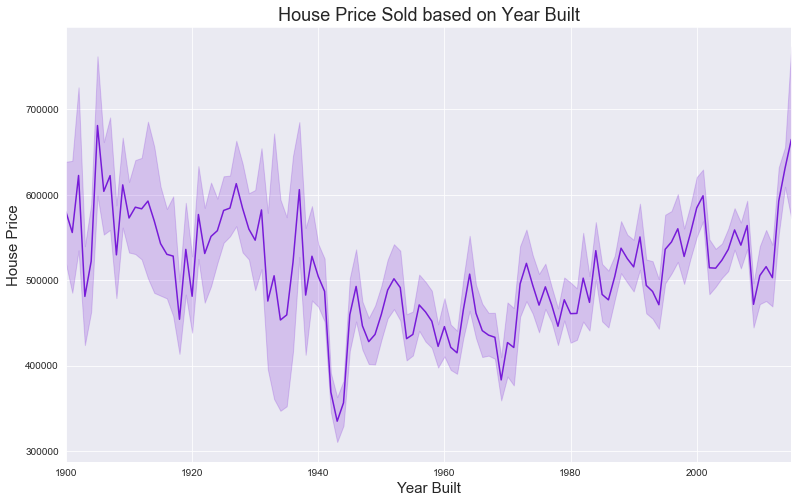

Houses built in the early part of the century, between 1900's and 1940's have on average sold for more when compared to houses built past 1940. There is a strong dip in house price for the houses built in 1940-1950, and there has been a significant increase in housing prices for newer construction.
### Q1b: Does renovation affect the sale price of a house?
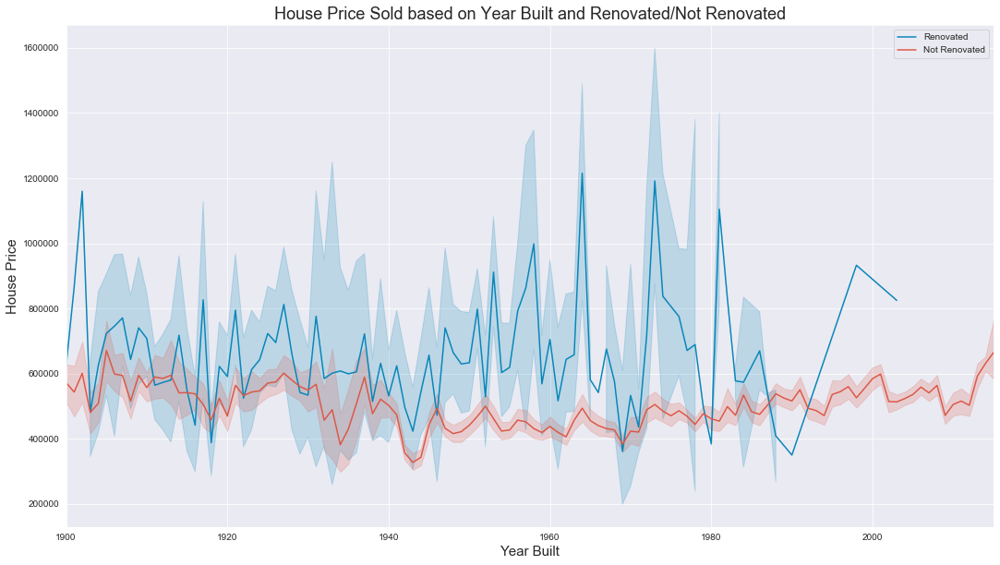

We can see there is a lot more variation in price of a home that has been renovated and on average, renovated homes do tend to sell for more, however if we had more data perhaps we could better explain some of the fluctuation. For example, was the renovation neccessary in order to bring the house up to code and put on the market in the first place? We need to keep in consideration that not all renovations are adding improvements to already good homes. The graph below also gives us more insight.

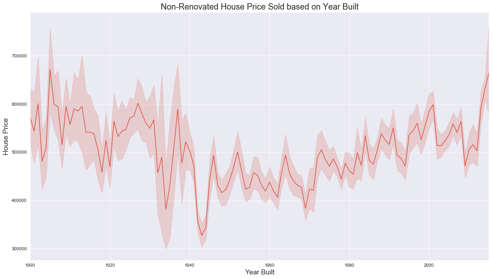
This looks exactly the same as the graph for our entire dataset. Similarities between the lines of non-renovated and total dataset can be attributed to the fact that most homes are not renovated. The sample size for renovated and not renovated are drastically different, where renovated homes account for less than 4% of the total dataset.

### Q2: What is the Relationship between Grade and Sale Price?
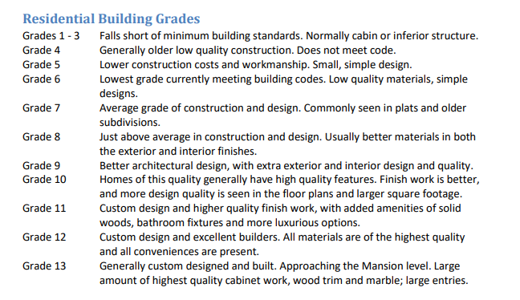
This is King County's definition for what each grade scale means. Any homes above 11 were considered outliers in our data trimming method.

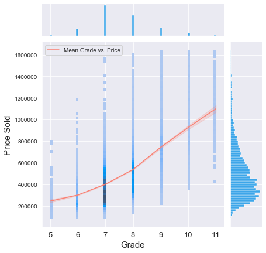
This graph provides a feel for everything. The points on the main graph show the distribution of house grades in relation to price, with darker coloring showing a greater concentration of houses sold at that grade/price combination. Across the graph we have a contrasting-colored line that shows the average relationship across grade. On the sides are histogram plots of both grade (on top) and price(to the right) providing the corresponding distribution. The Pearson correlation coefficient between the two is 0.65282, a moderately high coefficient and thus a fairly strong correlation.

### Q3: How does Sale Price Relate to Distance From Microsoft and Amazon HQ?
As a business, we would like to decide whether it would be better for our future employees if we were to establish a singluar HQ, or if we were to split it into multiple offices scattered about the area. In order to answer with, we will analyze how the location of 2 of the largest HQs in Seattle relate to housing price.
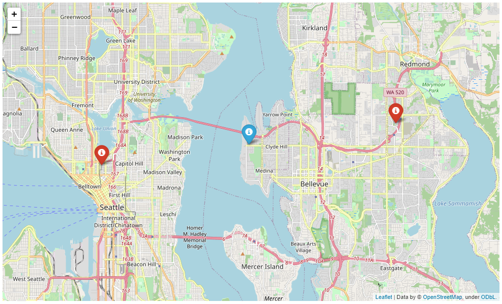
The red markers indicate the the locations of Microsoft and Amazon HQ while the blue marker is the centerpoint between the two. lat/long for the HQs was found thanks to Google and centerpoint is the average of the lat/long. I then used the pythagorean theorem to calculate the distance between each sold house and this centerpoint with the following:
```
df['distance_frm_center'] = (df['lat']-center[0])**2 + (df['long']-center[1])**2
```
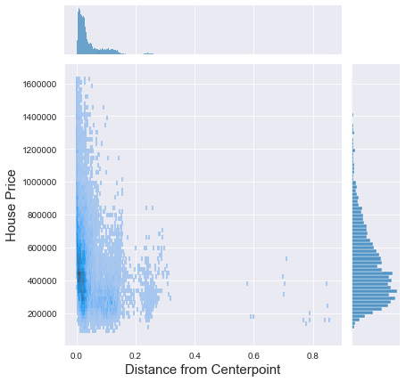
It looked like it could use a log transform so then I did that:
```
df['log_dist_frm_center'] = df['distance_frm_center'].map(lambda x: np.log(x))
```
A lot of the data seems to be located in one spot so in visualizing the data, I decided to have it locally weighted via turning lowess=True. This will also give us a line that represents the trend of the data. the height of the bins represent the confidence interval.
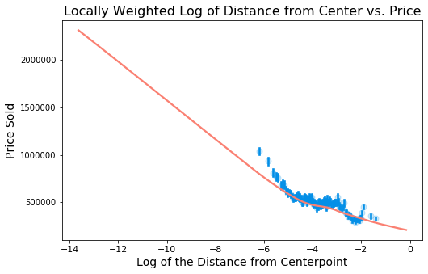
A larger negative number means it is closer to 0. There is some form of relationship between the distance from the center and price. We see that the most expensive houses tend to be located closer to this center point. From this we can say that the closer a home is to this point, the more expensive it is likely to be. This can be attributed to many different factors; there is more than one reason for wanting to live in downtown Seattle.
----
More information is needed in order to decide whether a singular or spread out HQ would be better, and it would be greatly to our advantage if we had data of this county for more than just 2015. It would be interesting to see what the effect of each of Microsoft and Amazon on the housing market in the respective years they established themselves in the city and the years that followed.

### Q4: How does Price relate to Population Density, and How does Population Density relate to In the City or Suburbs?
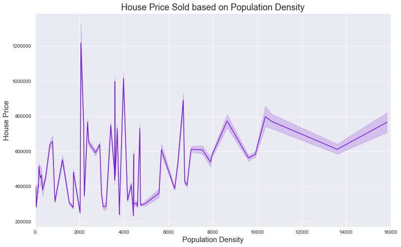
Population Densities were found for each zipcode. There does not appear to be a general or consistent trend when looking from least to highest population density. However, I was able to also acquire which zipcodes belong to the city, and which to the suburbs.

```options = [98155, 98177, 98133, 98155, 98125, 98117, 98103, 98115, 98105, 98102, 98112, 98109, 98107, 98119, 98199, 98122, 98144, 98134, 98108, 98118, 98168, 98106, 98126, 98136, 98116, 98146, 98178, 98121, 98101, 98154, 98104]  
seattle_proper = df[df['zipcode'].isin(options)] 
```
```
non_city_options = [98028, 98074, 98053, 98003, 98198, 98038, 98007, 98019, 98002, 98040, 98092, 98030, 98052, 98027, 98058, 98001, 98056, 98166, 98023, 98070, 98148, 98042, 98008, 98059, 98004, 98005, 98034, 98075, 98010, 98032, 98045, 98077, 98065, 98029, 98006, 98022, 98033, 98024, 98011, 98031, 98072, 98188, 98014, 98055, 98039]
burbs = df[df['zipcode'].isin(non_city_options)]
```
----
Categorizing and creating separate lines based on city or suburb, something interesting appears.

There is a distinct area of separation of population densities between city and suburbs. It makes intuitive sense, but the areas that are considered to be part of the city of Seattle are more dense than what is considered suburb. From the suburb representative area of the curve, the graph also shows that there are some suburbs that are significantly more expensive to live in than others.
----
Because of this distinct split, I have decided to split my dataset into two and create two predictive models: One for homes considered to be within the city, and another for homes considered to be in the suburbs.

## Final Models
Created a correlation heatmap to get a feel for what is correlated with price and to watch out for what may cause multicollinearity.
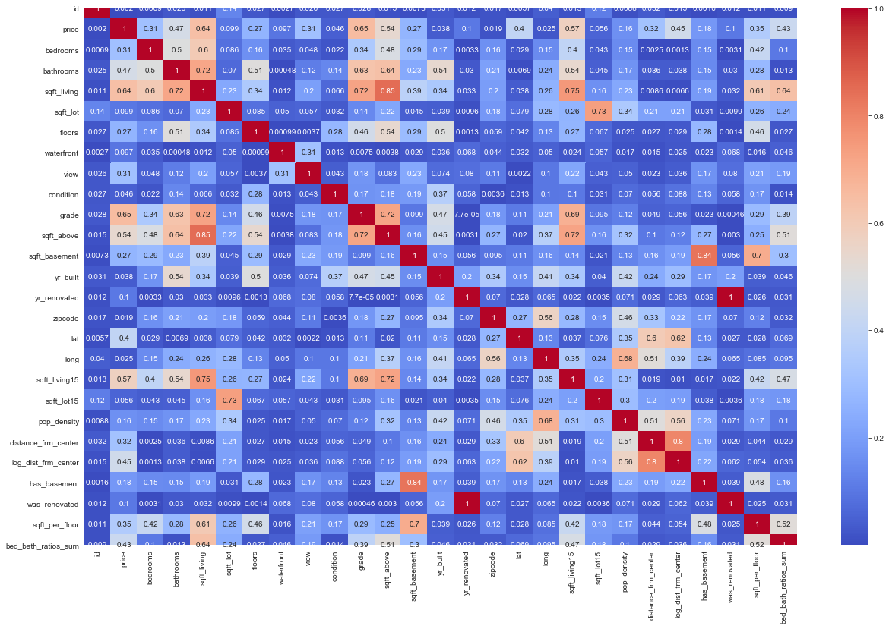
From here, I chose my variables and created two models, one for homes within the city and one for homes in the suburbs.
***Note***
I decided to include a constant in my model. When I excluded the constant and checked for multicollinearity, the strength of the means would overpower and the model would find multicollinearity. With a constant, none of our added features surpass our VIF threshold.

### Residuals Check
Since the amount of data was large, I printed graphs of the distribution on my residuals for each model.
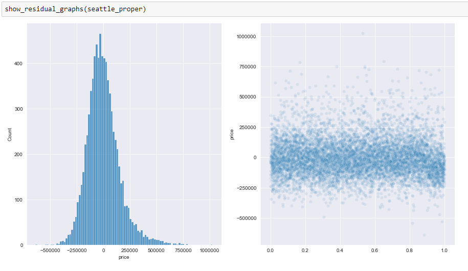
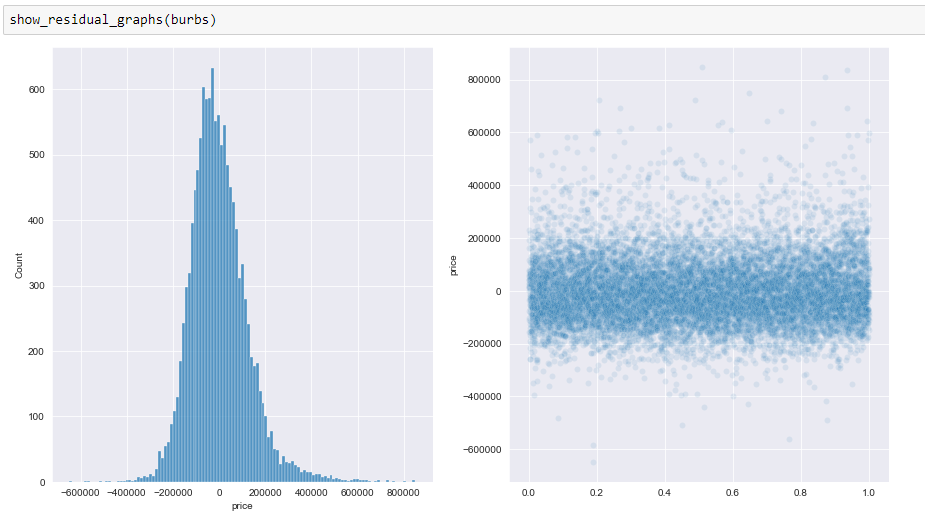

### OLS Regression Models

### Cross Validation in Sci-kit Learn

### Train-Test Split testing

## Business Reccommendations

## Future Work
It would be beneficial to acquire data that spans more than the course of one year to analyze the effect of the establishment of Microsoft and Amazon on the housing market in Seattle.
Furthermore, with this information we could answer the crucial question of whether to establish a single HQ or if it may be better to have multiple offices


## Additional Info and Special Thanks

Special Thanks to my fellow peers in my cohort at Flatiron for their continued support, my Instructor Rafael Carrasco for his continued guidance, and our Educational Coach Talia Salzberg-Horowitz for support, time-management advice, all else she does for us.


### GitHub Repository

Your GitHub repository is the public-facing version of your project that your instructors and potential employers will see - make it as accessible as you can. At a minimum, it should contain all your project files and a README.md file that summarizes your project and helps visitors navigate the repository.

### Jupyter Notebook

Your Jupyter Notebook is the primary source of information about your analysis. At a minimum, it should contain or import all of the code used in your project and walk the reader through your project from start to finish. You may choose to use multiple Jupyter Notebooks in your project, but you should have one that provides a full project overview as a point of entry for visitors.

For this project, your Jupyter Notebook should meet the following specifications:

#### Organization/Code Cleanliness

* The notebook should be well organized, easy to follow,  and code should be commented where appropriate.  
    * Level Up: The notebook contains well-formatted, professional looking markdown cells explaining any substantial code.  All functions have docstrings that act as professional-quality documentation
* The notebook is written for technical audiences with a way to both understand your approach and reproduce your results. The target audience for this deliverable is other data scientists looking to validate your findings.

#### Visualizations & EDA

* Your project contains at least 4 meaningful data visualizations, with corresponding interpretations. All visualizations are well labeled with axes labels, a title, and a legend (when appropriate)  
* You pose at least 3 meaningful questions and answer them through EDA.  These questions should be well labeled and easy to identify inside the notebook.
    * **Level Up**: Each question is clearly answered with a visualization that makes the answer easy to understand.   
* Your notebook should contain 1 - 2 paragraphs briefly explaining your approach to this project.

#### Model Quality/Approach

* Your model should not include any predictors with p-values greater than .05.  
* Your notebook shows an iterative approach to modeling, and details the parameters and results of the model at each iteration.  
    * **Level Up**: Whenever necessary, you briefly explain the changes made from one iteration to the next, and why you made these choices.  
* You provide at least 1 paragraph explaining your final model.   
* You pick at least 3 coefficients from your final model and explain their impact on the price of a house in this dataset.   

### Non-Technical Presentation Slides and Recording

Your non-technical presentation is your opportunity to communicate clearly and concisely about your project and it's real-world relevance. The target audience should be people with limited technical knowledge who may be interested in leveraging your project. For Phase 1, these would be Microsoft executives interested in making decisions about movie development.

Your presentation should:

* Contain between 5 - 10 professional-quality slides.  
    * **Level Up**: The slides should use visualizations whenever possible, and avoid walls of text.
* Take no more than 5 minutes to present.   
* Avoid technical jargon and explain the results in a clear, actionable way for non-technical audiences.

**_Based on the results of your models, your presentation should discuss at least two concrete features that highly influence housing prices._**

We recommend using Google Slides, PowerPoint or Keynote to create your presentation slides. We recommend using Zoom to record your live presentation to a local video file ([instructions here][]) - other options include Quicktime, PowerPoint, or Nimbus. Video files must be under 500 MB and formatted as 3GP, ASF, AVI, FLV, M4V, MOV, MP4, MPEG, QT, or WMV.

## Getting Started

Please start by reviewing this document. If you have any questions, please ask them in Slack ASAP so (a) we can answer the questions and (b) so we can update this document to make it clearer.

**When you start on the project, reach out to an instructor immediately via Slack to let them know and schedule your project review.** If you're not sure who to schedule with, please ask in your cohort channel in Slack.

Once you're done with the numbered topics in Phase 1, please start on the project. Do that by forking [the Phase 2 Project Repository][], cloning it locally, and working in the `student.ipynb` file. Make sure to also add and commit a PDF of your presentation to your repository with a file name of `presentation.pdf`.

## Project Submission and Review

Review [the Phase Project Submission and Review guidance][] to learn how to submit your project and how it will be reviewed. Your project must pass review for you to progress to the next Phase.

**Please note: We need to receive your complete submission at least 24 hours before your review to confirm that you are prepared for the review. If you wish to revise your submission, please do so no later than 3 hours before your review so that we can have time to look at your updated materials.**

## Summary

The end-of-phase projects and project reviews are a critical part of the program. They give you a chance to both bring together all the skills you've learned into realistic projects and to practice key "business judgement" and communication skills that you otherwise might not get as much practice with.

The projects are serious and important - they can be passed and they can be failed. Take the project seriously, put the time in, ask for help from your peers or instructors early and often if you need it, and treat the review as a job interview and you'll do great. We're rooting for you to succeed and we're only going to ask you to take a review again if we believe that you need to. We'll also provide open and honest feedback so you can improve as quickly and efficiently as possible.

[the Phase 2 Project Repository]: https://github.com/learn-co-curriculum/dsc-phase-2-project-online
[instructions here]: https://support.zoom.us/hc/en-us/articles/201362473-Local-recording
[the Phase Project Submission and Review guidance]: https://github.com/learn-co-curriculum/dsc-project-submissions-online
